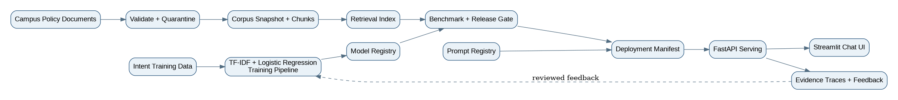

# Complete Tutorial: Build Campus Chat from Training to Production

## 1. Learning goal

This tutorial is designed for students who have never built an AI application. It demonstrates the complete path from training data to a locally deployed chat app.

The application is intentionally small, but its artifacts mirror the operating discipline described in Chapter 7:

- training data and corpus snapshots;
- reproducible model training;
- retrieval-index construction;
- benchmark evaluation;
- registries and promotion evidence;
- a deployment manifest;
- serving and monitoring;
- evidence traces and feedback.

The system does **not** require an LLM API. This is deliberate. Students can learn the lifecycle before adding a larger language model.

---

## 2. Architecture



Campus Chat has two AI paths.

### Path A: trained intent model

A labeled CSV contains questions such as “How do I reset my password?” and an intent such as `technical_support`. The training pipeline converts text to TF-IDF vectors and trains a Logistic Regression classifier.

### Path B: governed retrieval

A policy corpus is validated. Incomplete or non-public records are quarantined. Approved documents receive a corpus snapshot ID, are chunked, and are indexed with TF-IDF retrieval.

### Runtime path

A user question is classified, relevant approved chunks are retrieved, and a grounded response is assembled. The system records the active model, prompt, corpus, and index versions in an evidence trace.

---

## 3. Install the project

### Python 3.11 virtual environment

```bash
python -m venv .venv
```

Activate on Windows PowerShell:

```powershell
.\.venv\Scripts\Activate.ps1
```

Activate on macOS/Linux:

```bash
source .venv/bin/activate
```

Install:

```bash
python -m pip install --upgrade pip
pip install -r requirements.txt
```

Verify:

```bash
python -c "import pandas, sklearn, fastapi; print('Environment ready')"
```

---

## 4. Explore the data

### Intent data

Open `data/raw/campus_intents.csv`.

Important fields:

| Field | Meaning |
|---|---|
| `example_id` | Stable example identifier |
| `text` | Synthetic user question |
| `intent` | Target class used for training |

### Document corpus

Open `data/raw/campus_documents.csv`.

Important fields include document ID, title, text, owner, effective date, source URL, access classification, document version, and intended topic.

Three records are intentionally unsafe. They demonstrate missing ownership, missing effective dates, missing URLs, and confidential access.

### Benchmark

`data/eval/campus_benchmark.csv` records the expected intent and expected authoritative document for each benchmark question.

---

## 5. Run the reproducible training pipeline

```bash
python scripts/train_all.py
```

The script runs three modules:

1. `src.train_intent` trains and evaluates the intent classifier.
2. `src.build_retriever` validates documents, quarantines failures, snapshots the corpus, creates chunks, and builds the index.
3. `src.evaluate` runs application-level benchmark questions.

Inspect these outputs:

- `artifacts/training_run.json`
- `artifacts/model_registry.json`
- `artifacts/metrics.json`
- `artifacts/corpus_manifest.json`
- `artifacts/index_manifest.json`
- `artifacts/benchmark_results.csv`
- `artifacts/release_gate.json`
- `artifacts/deployment_manifest.json`
- `data/quarantine/quarantine_report.csv`

These are not decoration. Together they preserve the evidence needed to reproduce and defend the release.

---

## 6. Understand the trained model

The classifier uses TF-IDF to represent words and two-word phrases as numeric features. Logistic Regression learns weights that separate the intent classes.

Training code:

```python
vectorizer = TfidfVectorizer(
    lowercase=True,
    stop_words="english",
    ngram_range=(1, 2),
    max_features=3000,
)

model = LogisticRegression(
    max_iter=1500,
    class_weight="balanced",
    random_state=42,
)
```

The model file alone is not a reproducible experiment. The training run also records the data snapshot, vectorizer parameters, model parameters, split, code version, and metrics.

---

## 7. Understand retrieval and corpus governance

The retrieval builder first applies validation rules. Documents missing required metadata or marked non-public are quarantined.

Approved documents receive a corpus snapshot. That snapshot is then connected to:

- chunking version;
- retrieval-model version;
- index build ID;
- benchmark results;
- deployment manifest.

The index is derived serving state. It is not the source of truth. The source documents and corpus manifest remain authoritative.

---

## 8. Understand the release gate

The release gate checks multiple signals instead of trusting one metric.

Bundled thresholds:

| Check | Minimum/Maximum |
|---|---:|
| Intent accuracy | at least 0.80 |
| Intent macro F1 | at least 0.78 |
| Retrieval hit@3 | at least 0.85 |
| Critical validation failures | 0 |

A real system would add fairness, groundedness, safety, latency, privacy, accessibility, security, and regression checks.

---

## 9. Understand the deployment manifest

`artifacts/deployment_manifest.json` binds the active application state:

- intent model version;
- training run;
- prompt template version;
- corpus snapshot;
- chunking version;
- retrieval model;
- vector index;
- benchmark;
- safety policy;
- rollout pattern;
- rollback target;
- owner.

This is the Chapter 7 lesson in one artifact: production behavior depends on more than a model file.

---

## 10. Start the production-style API

```bash
uvicorn app.api:app --reload --port 8000
```

Open:

- `http://localhost:8000/health`
- `http://localhost:8000/manifest`
- `http://localhost:8000/docs`

Test the API:

```bash
curl -X POST "http://localhost:8000/chat"   -H "Content-Type: application/json"   -d '{"message":"How do I reset my password?"}'
```

On Windows PowerShell:

```powershell
Invoke-RestMethod `
  -Method Post `
  -Uri http://localhost:8000/chat `
  -ContentType 'application/json' `
  -Body '{"message":"How do I reset my password?"}'
```

---

## 11. Start the chat interface

In a second terminal:

```bash
streamlit run app/streamlit_app.py
```

Open `http://localhost:8501`.

Try:

- When is the add/drop deadline?
- How do I schedule an advising appointment?
- What happens to my financial aid if I drop a course?
- I forgot my password.
- How long can I borrow a library book?

---

## 12. Inspect evidence traces

Every API request writes a JSON file to `evidence/`.

A trace includes:

- request and response IDs;
- timestamp;
- predicted intent and confidence;
- active deployment version;
- active model, prompt, corpus, and index versions;
- retrieved chunk IDs and scores;
- final response;
- retention class.

This is the Evidence Contract. The Deployment Manifest represents the active Serving Contract.

---

## 13. Run tests and CI locally

```bash
python -m pytest -q
```

The included GitHub Actions workflow installs the environment, rebuilds artifacts, and runs tests after each push or pull request.

This is a simplified CI pipeline. Students can add release gates that fail the workflow when a metric or validation rule fails.

---

## 14. Run with Docker

```bash
docker compose up --build
```

The API will be available at port 8000 and the UI at port 8501.

Docker demonstrates environment reproducibility. It does not automatically make the system secure, scalable, or production-ready.

---

## 15. Quiet-failure exercises

### Exercise A: stale corpus

Change the add/drop document to a new version but do not rebuild the index. Compare the corpus manifest with the deployment manifest. Explain why the service may still run while giving stale answers.

### Exercise B: partial rollback

Change `prompt_template_version` or `vector_index_version` in the deployment manifest. Imagine rolling back only the intent model. Explain why application behavior may remain wrong.

### Exercise C: feedback contamination

Review `sample_feedback.csv`. Explain why a thumbs-down rating should not automatically become a training label.

### Exercise D: release gate

Raise the retrieval threshold above the bundled score. Re-run the gate and explain why deployment should be blocked even if the intent classifier is accurate.

---

## 16. Student extension options

1. Add a new campus intent and retrain.
2. Add five policy documents and update the benchmark.
3. Replace TF-IDF retrieval with sentence-transformer embeddings.
4. Add a SQLite feedback store.
5. Add login and role-based access for restricted documents.
6. Add a prompt-injection test set.
7. Add canary manifests and compare versions.
8. Add a monitoring dashboard showing intent distribution, fallback rate, and source freshness.
9. Add a real LLM only after preserving the same prompt, corpus, index, benchmark, and trace versions.
10. Convert the project into the team’s Homework 3 proof of concept.

---

## 17. What production readiness would still require

This project is production-style, not production-ready. A real deployment would require:

- authoritative and continuously governed university data;
- institutional ownership and approval;
- privacy and security review;
- accessibility testing;
- authentication and authorization;
- secrets management;
- robust monitoring and alerting;
- backup and disaster recovery;
- human escalation and incident response;
- legal and policy review;
- load testing and service-level objectives;
- a safe rollback strategy for all application artifacts.

---

## 18. Chapter 7 reflection questions

1. Which artifacts are needed to reproduce the intent model?
2. Which artifacts define the live retrieval application?
3. Why is the vector index not source-of-truth storage?
4. What should block release even when model accuracy passes?
5. Which feedback records are safe to use for retraining?
6. Who owns model promotion, corpus freshness, prompt approval, and rollback?
7. Why is MLOps best understood as a handshake between data, ML, product, and governance teams?
